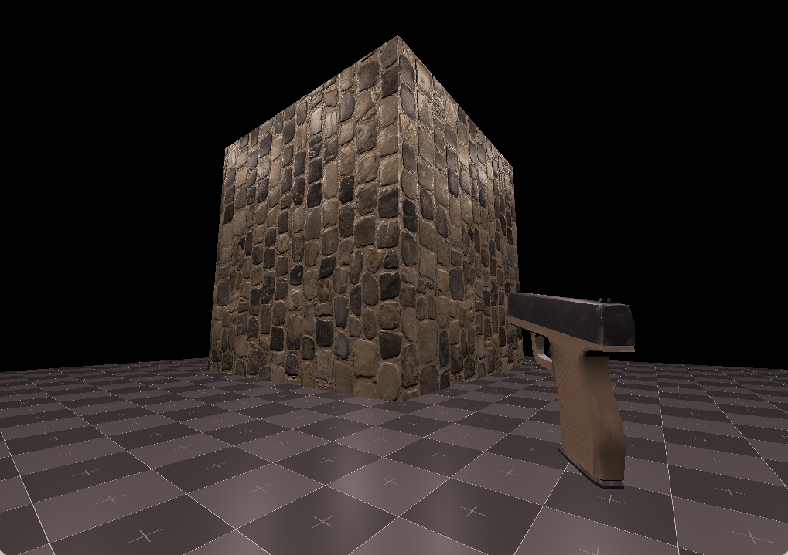
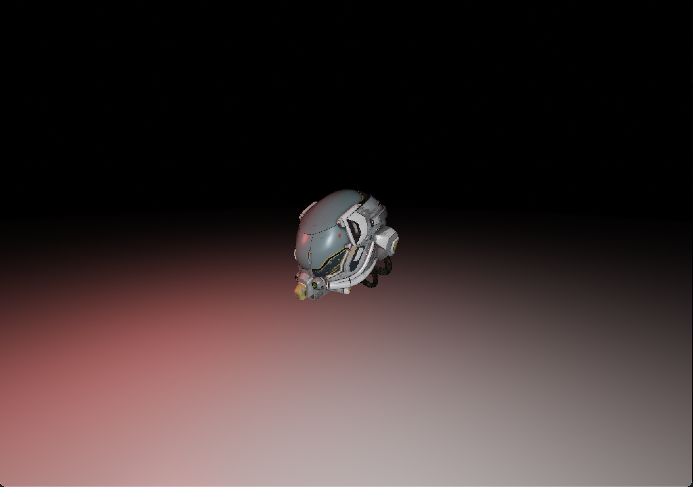

# Foxtrot Engine
Foxtrot is a 3D game engine being developed for an experimental game.

## Features
- Fast math library using SIMD
	- Supports Arm NEON and SSE/AVX.
- Vulkan rendering backend
- Super fast custom memory pool
- Multithreaded and extensible asset manager that works seamlessly in the background
- Custom core library and containers
- GLTF loading with cgltf, JPEG loading with turbojpeg and other format loading using stb-image
- Integration with Jolt Physics
- Deferred rendering with light volumes

## Platforms
- Windows (x86_64)
- macOS (aarch64)

## Screenshots
**PBR Lighting**

<!---->

