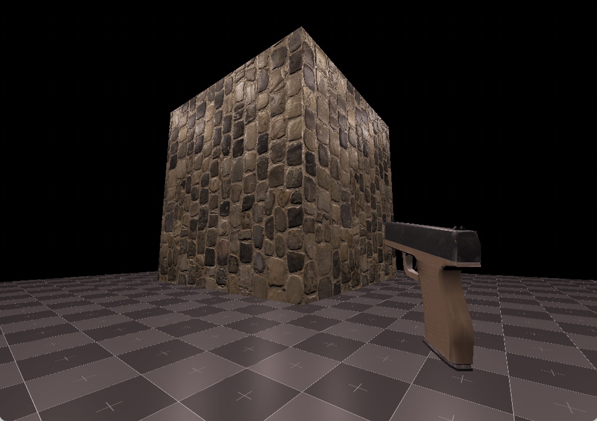
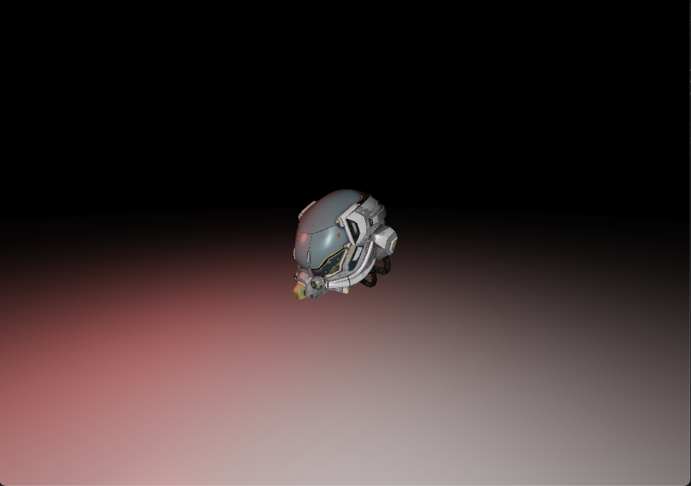

# Foxtrot Engine
Foxtrot is a 3D game engine being developed for an experimental game.


## Features
- Fast math library using SIMD
	- Supports Arm NEON and SSE/AVX.
- Vulkan rendering backend
- Super fast custom memory pool
- Multithreaded and extensible asset manager that works seamlessly in the background
- Custom core library and containers
- GLTF loading with cgltf, JPEG loading with turbojpeg and other format loading using stb-image
- Integration with Jolt Physics
- Deferred rendering with light volumes

## Building
To build the engine, make sure you have Premake5 installed.

### Building for MacOS
You can use `premake5 [build system]` to generate the project files. To build with Ninja, you use one of the generated build targets.
For example,
```
# Generate the project or build files
premake5 ninja

# Build the engine and third party libraries
ninja RelWithDebInfo_macOS

# Run the engine
./build/RelWithDebInfo/foxtrot
```


## Platforms Supported
- Windows (x86_64)
- macOS (aarch64)

## Screenshots
**PBR Lighting**



<!---->

