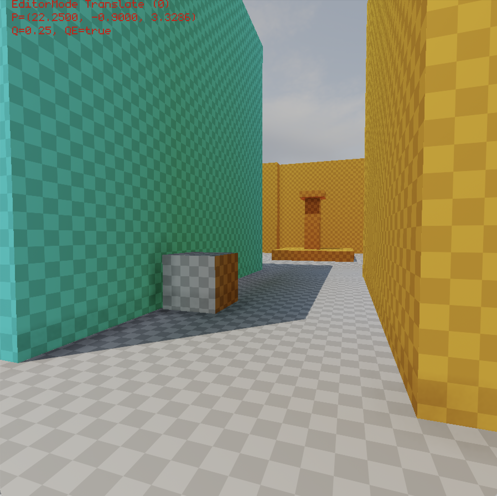
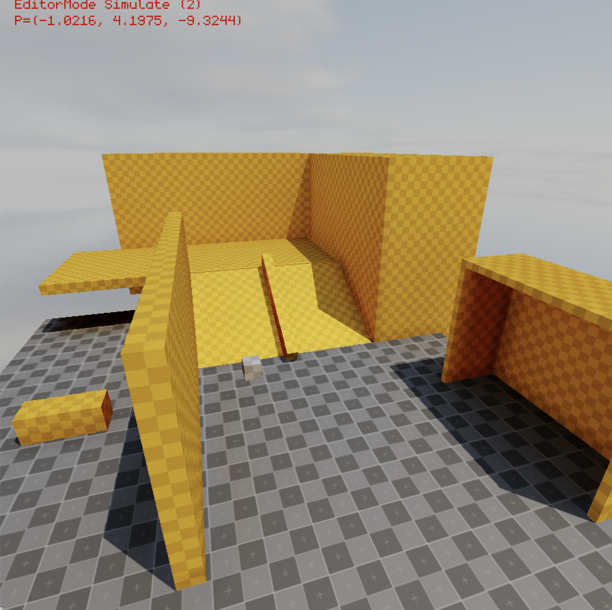
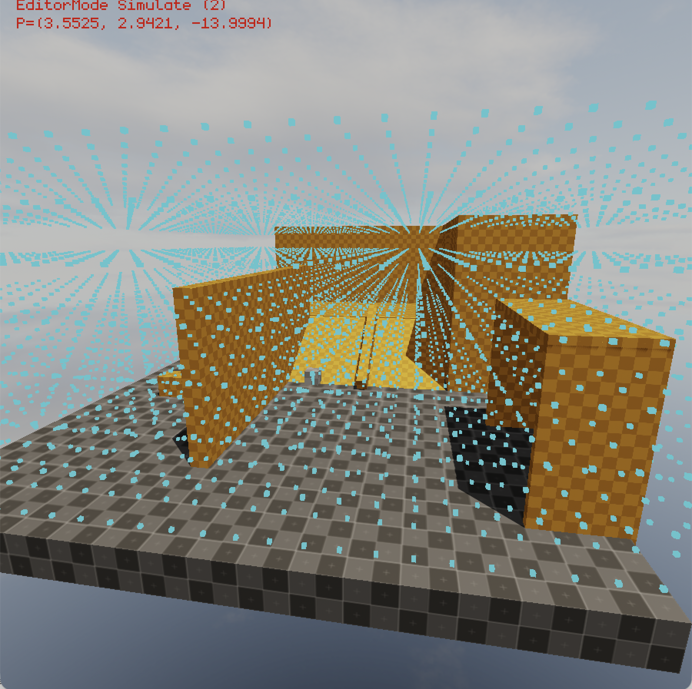

# Foxtrot Engine

Foxtrot is a 3D game engine being developed for an experimental game.

## Features

- Tiled forward renderer (Forward+) with Vulkan
- Blockout editor for building prototype levels fast
- Baked light probe global illumination
- Fast math library using SIMD
    - Supports Arm NEON and AVX processors.

- Scripting with [Strata](https://github.com/StrataLanguage/stratac), compiled JIT
    - All in-game editor modes are written in Strata.
- Custom core library and containers
- Multithreaded and extensible asset manager that works seamlessly in the background
- Jolt Physics integration

## Docs

| Name               | Document                                |
| ------------------ | --------------------------------------- |
| FoxScript (Legacy) | [FoxScript.md](Docs/FoxScript.md)       |
| Config format      | [ConfigFormat.md](Docs/ConfigFormat.md) |

## Building

To build the engine, make sure you have CMake installed.

### Building for MacOS

You can use `cmake` to generate the project files. To build with Ninja, you use one of the generated build targets.
For example,

```
# Generate the project or build files
cmake -GNinja -DUSE_SIMDE=Off -DUSE_MOLTENVK=On .

# Build Foxtrot
ninja

# Run the executable. Replace `Debug` with the optimization level you built with.
./build/Debug/foxtrot
```

## Platforms Supported

- Windows (x86_64)
- macOS (aarch64)

## Screenshots

|              Global Illumination              |          Dynamic Physics Level          |
| :-------------------------------------------: | :-------------------------------------: |
|   |  |
|               Probe Debug View                |                                         |
|  |                                         |
